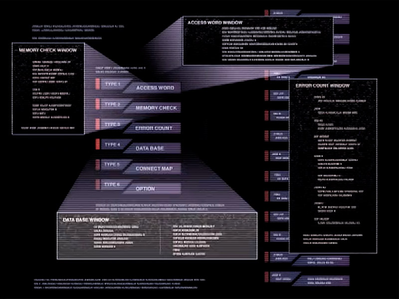
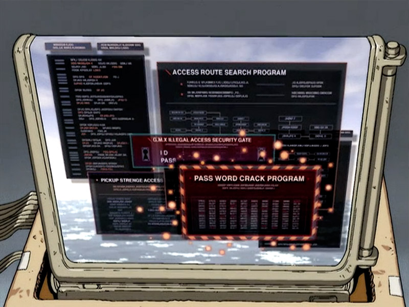
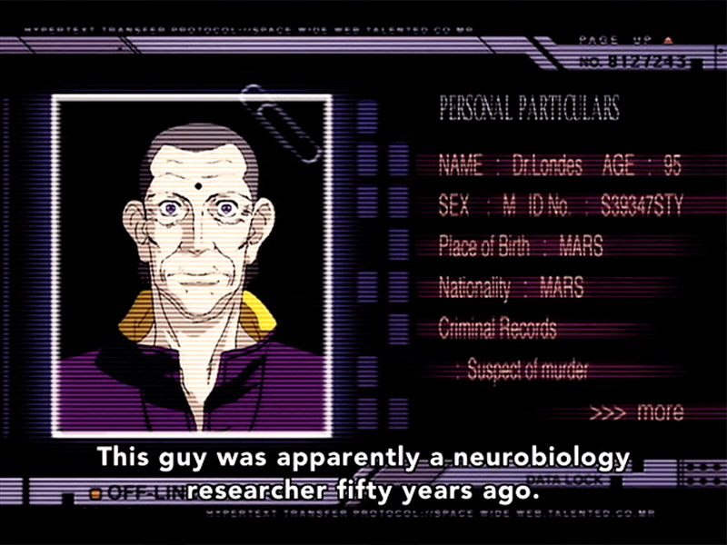

---

title: 'Old-Web Mixtape'

date: '2025-11-24'

category: 'Self'

excerpt: 'A terminal-inspired corner of the web where everything looks like htop and feels like Cowboy Bebop.'

---
I built this website because I wanted a personal space to share the content I love, exactly the way I want to share it. It’s also become my own curated feed. I only save things I’d actually be comfortable showing other people, which naturally filters out a lot of junk and improves the quality of what I watch every day.

A big part of the design comes from the years I spent growing up on Linux, messing around with cool terminal tools. I still remember the first time I installed htop. I was blown away by how something so powerful could feel so clean and easy to read at the same time.

Another huge influence is Cowboy Bebop. I loved how the characters pulled up information directly through their own custom interfaces, and whatever data appeared always matched the style of that interface perfectly. That feels so much more cohesive than today’s web, where every site fights for its own look and branding.

 |  |
|--|--|
|  |  |

And who could forget the golden era of Nexopia, MySpace, Neopets, back when platforms actually let you go wild with HTML and CSS on your own profile? I miss that freedom like crazy. This site is my small attempt to bring a little of that old-web spirit back.

There’s still a lot more I want to add, and I hope you stumble across something here that you enjoy too.
 
